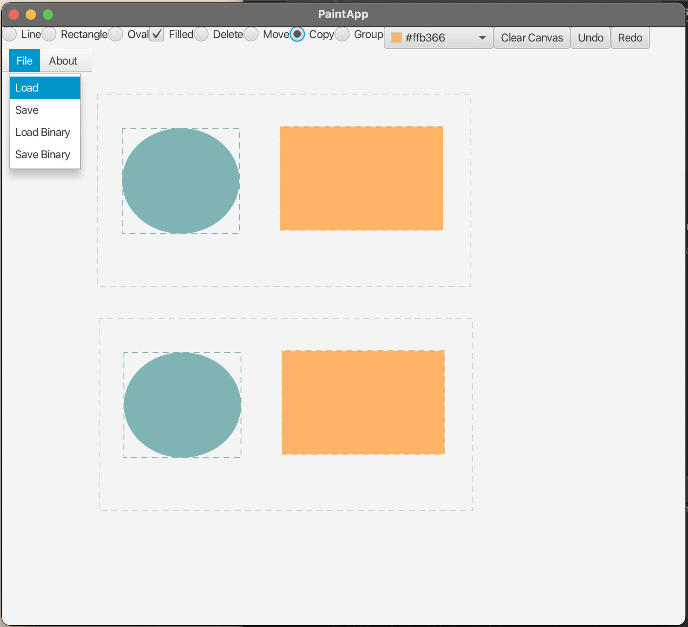

# Shape Editor

This is a JavaFX GUI based desktop application that allows users to draw, edit, group, clear, copy, undo, and redo different shapes of different color. It also allows users to save and load their file.

## Screenshots

